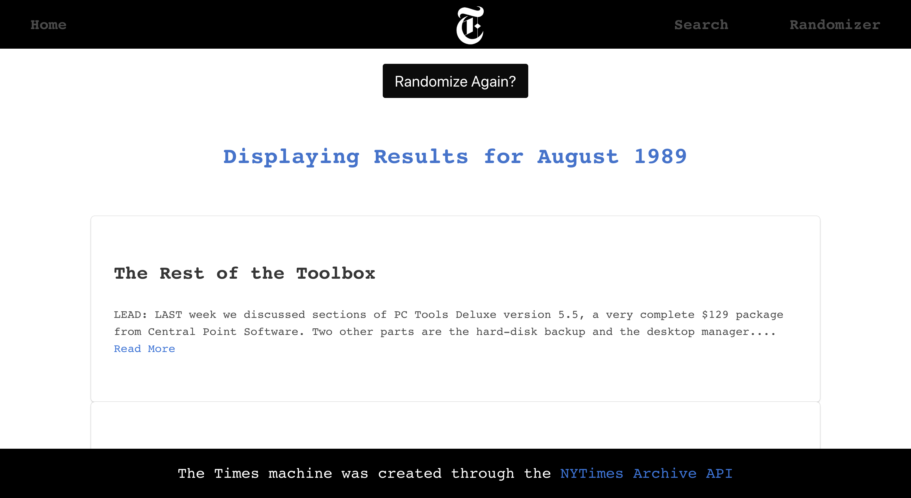

## The Times Machine App
# WDI-Project 2


## Goal
The goal was to build build a React application that consumes a public API.

## Timeframe
2 days

## Technologies used
* HTML5, CSS - Bulma(CSS Framework)
* JavaScript (ES6)
* jQuery
* React
* API: The New York Times Archive
* Insomnia

### Website
https://the-times-machine.herokuapp.com/

# Overview
The Times Machine is a tech news app inspired by the New York Times Archive. Our app allows readers to step back in time, and check out tech stories from the past. Users can search for technology and science stories dating back to 1920.

# Instructions
To access stories, a user simply has to select a month and year on the search page for results to appear. Our app also features a randomizer button. After clicking the button, a user will receive a random set of headlines, from a particular year and month determined by our algorithm.   

# Process
The creation of our app began with testing out the NYT Archive API. After experimenting with results through Insomnia, our team took the following steps:
1. Creating a webpack and API key
2. Creating the app’s wireframes.
3. Writing out and planning the pseudo code.
4. Creating and establishing the Web Token
5. Creating the main pages, objects and components: searches, searchesNew, searchesForm, nav, randomizer etc.
6. Creating a search function using keywords set by the NYT Archive API. Due to the sheer amount of data, our main goal was to filter technology news.
7. To style our page, we used a combination of Bulma, CSS and NYT logos.

# Screenshots

### Home page
The users can click to the search and randomizer button on the home page.


### Search page
After clicking to the search button, the website navigates to the search page. The users should select a month and year from the dropdown menu.


### Search Results
The news are populated from the archive for the month and the year that users selected. Year selection is limited from 1920 to 2015. And the news are limited to the technology news.


### Randomizer
After clicking to the search button, the website navigates to the randomizer page. The users can simply click to the randomizer button to get random news.


### Randomizer Results



# Challenges
* To limit search results
* To get random news (randomizer)

# Wins
* This is how we got the news from the API and limited it to technology.
```javascript
handleSubmit(e) {
  this.setState({ loading: 'true' })
  e.preventDefault()
  console.log(this.state.data.year, this.state.data.month, key)
  axios.get(`https://api.nytimes.com/svc/archive/v1/${this.state.data.year}/${this.state.data.month}.json?api-key=${key}`)
    .then(res => {
      const stories = res.data.response.docs.filter(story => story.keywords.find(item => {
        return (item.value.includes('Technology') || item.value.includes('TECHNOLOGY'))
      }) || (story.section_name !== null && story.section_name.includes('Technology')))
      this.setState({ stories, loading: 'false' })
    })
    .catch(err => console.log(err))
    .catch(err => this.setState({ errors: err.response.data.errors }))
}
```
* Strengthened my knowledge of React
* Creating a “Randomizer” function

# Future Features
* Make it responsive
